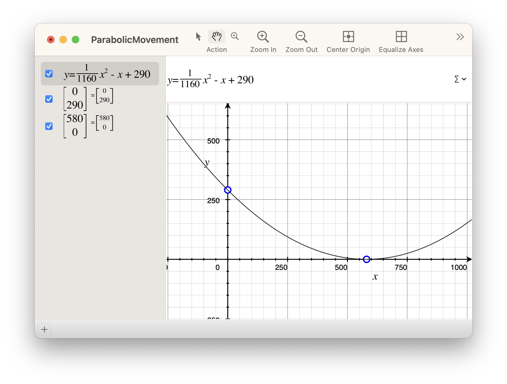

Collection View Layout that moves items in a physically correct way.


## Requirements

- iOS 13.0+
- swift 5.5+

## Installation

This repository can be installed via Swift Package Manager.

```swift
dependencies: [
    .package(
        url: "https://github.com/heheilik/ParabolicMovementLayout.git",
        .upToNextMajor(from: "1.0.0")
    )
]
```

## Usage

First of all, you need to define `startPosition`, which is an offset from the top edge of `collectionView`. At startPosition:
- Speed of item is equal to `startVelocity`
- Size of item is equal to `itemStandardSize`
- Scale of item is equal to 1

`startVelocity` must be a negative number, since items move up when `contentOffset` grows.

`itemStandardSize` is always used for layout, then whole view is scaled linearly. Scale of item at top is equal to `scaleAtVertex`.

`spacingDivisionCoefficient` defines the coefficient that will be used to define spacing between items. Path from `startPosition` to top will be divided by it, then the result is used as offset between items. For example, if you set `spacingDivisionCoefficient` to `n`, you'll get `n+1` items placed from `startPosition` to top.

Items disappear when item's top edge is overlapped by top edge of previous item. If you want delay disappearance at top (if you have shadows, for example), provide offset value to `disappearanceTopItemOffset` parameter.

Items also disappear at bottom edge of collection view. When initializing layout programmatically, you are required to provide `fallbackCollectionViewHeight`, because `collectionView` property is used to get height value by default, and it's not accessible when calculation occurs.

## Math details

Here is the description of math that lies behind the implementation. The example project is analyzed here.

#### Defining movement for single item

The basis of the movement is the function of physical objects movement with constant acceleration. The common way to describe this movement is following equation:

$y = \frac{a}{2} \times x^2 + v_0 \times x + x_0,$ where:
- $a$ is acceleration,
- $v_0$ is start velocity,
- $x_0$ is start position.

Here, $x$-axis represents the `contentOffset` property of `collectionView`, and $y$-axis represents the position of top edge of item in frame of `collectionView` (will be refered as `position` later).

The implementation actually doesn't need the real acceleration value, so following version of equation is used:

$y = a_c \times x^2 + v_0 \times x + x_0,$ where $a_c = \frac{a}{2}$ — acceleration coefficient.

To define a movement function, we need to define `startVelocity` and `startPosition`. Layout will calculate the acceleration coefficient by itself.

Let `startVelocity = -1`, `startPosition = 290`:



Layout generates the function with three important properties:
- The movement is actually inverted relative to $y$-axis, because $y$-axis is inverted in UIKit.
- When $x$ is equal to zero, the position of item is equal to `startPosition`.
- The minimal value of $y$ is zero. It means that item will go up exactly for `startPosition` points and turn around.

#### Defining movement for multiple items

The movement depends on `contentOffset`. For first item, `position = startPosition` when `contentOffset = 0`. Basically, it means that `0` is the value of `contentOffset` needed for first item to be placed at `startPosition`.

The idea is to associate some `contentOffset` value with every item and say that item will have its `position` equal to `startPosition` when `contentOffset` reaches this value. Now values of $x$ can be shifted for each item independently using those associated values.

That allows to define movement of multiple items using single function. The only thing left is to define how to shift the value of $x$.

It can be done using index of item and some fixed constant. That will define how far will the adjanced items be positioned.

This constant is defined by `spacingDivisionCoefficient` parameter. The length of segment on $x$-axis from 0 to vertex $x$ coordinate is divided by it, the result is used as spacing between items. You can use a floating-point value if you need.
